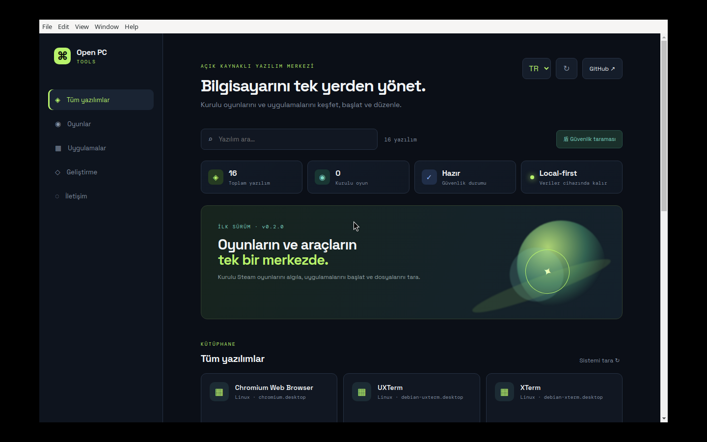

# Open PC Tools v0.7.0 Kullanım Kılavuzu

> Windows, Linux ve macOS için açık kaynaklı oyun ve PC yazılımı merkezi



*Şekil 1 — Open PC Tools v0.7.0 ana dashboard ekranı. Görüntü, Electron uygulamasının Linux üzerinde gerçek çalıştırmasından alınmıştır.*

## İçindekiler

1. [v0.7.0 ile gelenler](#v070-ile-gelenler)
2. [Kurulum](#kurulum)
3. [İlk açılış](#ilk-açılış)
4. [Dashboard kullanımı](#dashboard-kullanımı)
5. [Oyun ve uygulama keşfi](#oyun-ve-uygulama-keşfi)
6. [Steam hesap kasası](#steam-hesap-kasası)
7. [Mağaza bağlantıları](#mağaza-bağlantıları)
8. [Steam saatleri ve başarımlar](#steam-saatleri-ve-başarımlar)
9. [Profil yönetimi](#profil-yönetimi)
10. [Güvenlik taraması](#güvenlik-taraması)
11. [IBAN bağış paneli](#iban-bağış-paneli)
12. [Otomatik güncelleme](#otomatik-güncelleme)
13. [Sorun giderme](#sorun-giderme)
14. [Gizlilik ve güvenlik özeti](#gizlilik-ve-güvenlik-özeti)

## v0.7.0 ile gelenler

- Windows, Linux ve macOS uyumlu Electron uygulaması
- Steam oyunlarını ve kurulu PC yazılımlarını algılama
- Arama, kategori filtresi ve tek tıkla başlatma
- Yerel dashboard istatistikleri
- Steam hesap kasası
- Steam, Xbox/Microsoft, Epic, GOG, Ubisoft, EA, Battle.net, itch.io, Heroic ve Lutris için resmî giriş bağlantıları
- Steam Web API ile oyun saatleri ve başarımları
- Cihazda saklanan yerel profil
- Windows Defender veya Linux ClamAV ile seçili klasör taraması
- GitHub Releases tabanlı güncelleme kontrolü
- Türkiye için IBAN placeholder bağış paneli
- Türkçe ve İngilizce arayüz
- Güvenli oyun performans profilleri ve Türkçe yama kaynak araması

## Kurulum

### Kaynaktan çalıştırma

Node.js 20 veya daha yeni bir sürüm ve npm gerekir.

```bash
git clone https://github.com/nkeremkarakas-hue/open-pc-tools.git
cd open-pc-tools
npm install
npm start
```

Geliştirme modu için:

```bash
npm run dev
```

### Paketleme

```bash
npm run dist
```

Paketler `dist/` klasöründe oluşturulur. Hedef işletim sistemine uygun paket üretmek için komutu mümkünse hedef sistemde çalıştırın.

## İlk açılış

Uygulama ilk açıldığında:

1. Sisteminizdeki uygulama kısayollarını tarar.
2. Steam kütüphane klasörlerini kontrol eder.
3. Bulunan yazılımları kategori kartlarıyla gösterir.
4. Yerel profil için varsayılan görünen ad oluşturur.

Uygulama internete ihtiyaç duymadan temel kütüphane özelliklerini çalıştırabilir. Steam Web API ve güncelleme kontrolü isteğe bağlı çevrimiçi özelliklerdir.

## Dashboard kullanımı

Ana ekran dört ana alandan oluşur:

- **Sol menü:** Tüm yazılımlar, Oyunlar, Uygulamalar, Geliştirme ve İletişim filtreleri.
- **Üst alan:** Dil seçimi, yenileme ve GitHub bağlantısı.
- **İstatistik kartları:** Toplam yazılım, kurulu oyun, güvenlik durumu ve local-first veri bilgisi.
- **Kütüphane:** Algılanan uygulama ve oyun kartları.

### Arama ve filtreleme

Arama kutusuna uygulama adının bir bölümünü yazın. Sol menüden kategori seçtiğinizde sonuçlar kategoriye göre daraltılır. **Sistemi tara** düğmesi uygulama listesini yeniden oluşturur.

### Yazılım başlatma

Bir karttaki **Başlat** düğmesine basın. Steam oyunlarında `steam://rungameid/...` protokolü kullanılır. Özel yazılımlar doğrudan çalıştırılabilir dosya yolu üzerinden açılır.

## Oyun ve uygulama keşfi

### Steam oyunları

Steam oyunları kurulu Steam kütüphanelerindeki `appmanifest_*.acf` dosyalarından okunur. Bu yöntem yalnızca cihazda kurulu ve yasal olarak bulunan oyunları listeler; internetten oyun veya crack indirmez.

### Linux

Aşağıdaki `.desktop` dizinleri taranır:

- `/usr/share/applications`
- `~/.local/share/applications`

### macOS

Aşağıdaki uygulama klasörleri taranır:

- `/Applications`
- `~/Applications`

### Özel yazılım ekleme

1. Sol menüden **Özel yazılım ekle** seçeneğini açın.
2. Yazılım adını yazın.
3. Çalıştırılabilir dosya yolunu girin.
4. Kategori seçin.
5. **Ekle** düğmesine basın.

## Steam hesap kasası

**Steam hesap kasası**, hesabı hatırlamayı kolaylaştırmak için hesap etiketi ve kullanıcı adını gösterir.

1. **Steam hesap kasası** düğmesini açın.
2. Hesap adını girin: `Ana hesap`, `Yedek hesap` gibi.
3. Steam kullanıcı adını girin.
4. Parolayı girin.
5. **Güvenli kaydet** seçeneğine basın.

Parola düz metin tutulmaz. Electron `safeStorage` kullanılır:

- Windows: Windows DPAPI
- macOS: Keychain
- Linux: Secret Service/libsecret

Uygulama parolayı Steam’e otomatik göndermez. Hesap kartındaki Steam’i açarak oturum açma işlemini Steam’in kendi ekranında tamamlayın.

## Mağaza bağlantıları

**Mağaza bağlantıları** paneli aşağıdaki sağlayıcıların resmî giriş sayfalarını açar:

- Steam
- Xbox / Microsoft
- Epic Games
- GOG
- Ubisoft Connect
- EA app
- Battle.net
- itch.io
- Heroic Games Launcher
- Lutris

Bu bağlantılar phishing riskini azaltmak için uygulamanın parola toplamasını engeller. **Resmî giriş** düğmesine basınca sağlayıcının kendi HTTPS sayfası açılır. Şifreyi Open PC Tools’a vermeyin.

## Steam saatleri ve başarımlar

### API anahtarı oluşturma

Steam Web API anahtarını Steam’in resmî alanından oluşturun. Anahtarı GitHub issue, README, ekran görüntüsü veya sohbet mesajında paylaşmayın.

### Uygulamada ayarlama

1. **Steam istatistikleri** panelini açın.
2. Steam Web API anahtarını girin.
3. SteamID64 değerini girin. Genellikle `7656119...` ile başlar.
4. **Güvenli kaydet** seçeneğine basın.
5. **İstatistikleri getir** seçeneğine basın.

Panel şunları gösterir:

- Toplam oyun sayısı
- Toplam oyun saati
- En çok oynanan oyunlar
- Her oyun için oynama saati
- Kazanılan / toplam başarım
- Başarım yüzdesi

Profil gizliyse Steam API eksik veya boş sonuç döndürebilir. Bu durumda Steam profilinizin oyun ayrıntılarını görünür yaptığınızdan emin olun.

API anahtarı `steam-api.json` dosyasına OS güvenli kasası üzerinden şifrelenmiş şekilde yazılır; renderer katmanına geri gönderilmez.

## Profil yönetimi

Sol menüdeki **Profil** düğmesini açın. Aşağıdaki alanları değiştirebilirsiniz:

- Görünen ad
- Avatar
- Dil tercihi

Profil yereldir ve `profile.json` dosyasında `0600` izinleriyle tutulur. Kullanıcı hesabı, parola veya Steam API anahtarı profil dosyasına yazılmaz.

## Güvenlik taraması

1. **Güvenlik taraması** düğmesini açın.
2. Taramak istediğiniz klasörün yolunu girin.
3. **Taramayı başlat** seçeneğine basın.

Destek:

- Windows: Windows Defender `Start-MpScan`
- Linux: ClamAV `clamscan`
- macOS: Bu sürümde yerel üçüncü taraf tarayıcı entegrasyonu yoktur.

ClamAV yoksa Linux’ta kurulumu:

```bash
sudo apt install clamav
```

Uygulama kendi antivirüs motoru olduğunu iddia etmez; cihazdaki mevcut aracı çağırır.

## IBAN bağış paneli

Bağış menüsü Türkiye’deki kullanıcılar için **IBAN banka havalesi** tasarlanmıştır. v0.7.0 reposunda gerçek IBAN yayınlanmaz; placeholder bulunur.

Gerçek bilgiler daha sonra `src/config/donation.json` içinde yapılandırılabilir. IBAN’ı public GitHub deposuna koymadan önce açıkça public paylaşım onayı alınmalıdır.

Stripe, PayPal ve Ko-fi bu sürümde görünür değildir.

## Otomatik güncelleme

Uygulama paketlenmiş durumda **Güncellemeleri kontrol et** düğmesiyle GitHub Releases kaynağını kontrol eder. Geliştirme modunda kontrol yapılmaz.

Dağıtım için:

1. Yeni sürüm numarasını `package.json` içinde artırın.
2. Git tag oluşturun.
3. Windows, Linux ve macOS paketlerini üretin.
4. GitHub Release oluşturun.
5. Artefact’ları Release’e yükleyin.
6. Dağıtım öncesi imzalama sertifikalarını yapılandırın.

Auto-updater altyapısında otomatik indirme kapalıdır; kullanıcıya yeni sürüm bulunduğu bildirildikten sonra indirme/kurulum akışına geçilmelidir.

## Sorun giderme

### Steam oyunları görünmüyor

- Steam’in kurulu ve en az bir oyunun kurulu olduğunu kontrol edin.
- Steam’i kapatıp uygulamada **Sistemi tara** düğmesine basın.
- Steam kütüphanesinin standart dışı konumda olup olmadığını kontrol edin.

### Steam istatistikleri boş

- SteamID64’ü doğrulayın.
- API anahtarını yeniden kaydedin.
- Profil ve oyun ayrıntılarının gizli olmadığını kontrol edin.
- Steam API’nin ilgili oyunda başarım verisi sunmayabileceğini unutmayın.

### Linux’ta güvenli kasa kullanılamıyor

Masaüstü Secret Service/libsecret sağlayıcısının aktif olduğundan emin olun. Güvenli kasa kullanılamıyorsa uygulama parolayı kaydetmez.

### Güncelleme bulunamıyor

- Uygulamanın paketlenmiş sürümünü çalıştırın.
- GitHub Release’in doğru repository’ye ait olduğunu kontrol edin.
- Release artefact’larının platform ve mimariye uygun olduğundan emin olun.
- Geliştirme modunda updater bilerek devre dışıdır.

## Gizlilik ve güvenlik özeti

- Renderer’da Node.js erişimi kapalıdır.
- IPC yalnızca whitelist edilmiş fonksiyonlar sunar.
- API anahtarı ve parolalar OS güvenli kasasıyla korunur.
- Kullanıcı profili cihazda tutulur.
- Gerçek IBAN ve ödeme bilgileri repoya eklenmemiştir.
- Sağlayıcı girişleri resmî sayfalara yönlendirilir.
- Uygulama korsan oyun, crack veya lisanssız indirme sağlamaz.
- v0.8.0 ile IBAN biçimi doğrulanır; placeholder değerler kopyalanamaz.
- Steam API çağrıları ağ zaman aşımına karşı korunur.
- Linux ClamAV tespiti shell komutu çalıştırmadan yapılır.

## Test komutu

```bash
npm test
```

v0.7.0 testleri profil dosyası izinlerini, Steam saat/başarım dönüşümünü, güvenlik modülünü ve kasa sözleşmesini doğrular.

## Proje bağlantıları

- [GitHub deposu](https://github.com/nkeremkarakas-hue/open-pc-tools)
- [Steam Web API açıklaması](../docs/STEAM-STATS.md)
- [Profil ve auto-updater açıklaması](../docs/PROFILE-AND-UPDATES.md)
- [Steam hesap kasası açıklaması](../docs/STEAM-VAULT.md)
- [Bağış paneli açıklaması](../docs/DONATIONS.md)
